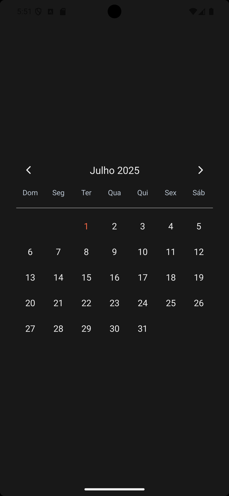

# 📅 Calendar App

Um aplicativo de calendário moderno e elegante desenvolvido com React Native e Expo, com suporte completo ao português brasileiro.


## ✨ Características

- 🌟 Interface moderna e responsiva com tema escuro
- 🇧🇷 Localização completa em português brasileiro
- 📱 Suporte multiplataforma (iOS, Android, Web)
- 🎨 Design personalizado com cores vibrantes
- 📅 Seleção interativa de datas
- 🚫 Bloqueio de datas passadas
- ⚡ Performance otimizada com TypeScript

## 🚀 Tecnologias Utilizadas

- **React Native** - Framework para desenvolvimento mobile
- **Expo** - Plataforma para desenvolvimento e deploy
- **TypeScript** - Superset tipado do JavaScript
- **react-native-calendars** - Componente de calendário altamente customizável
- **@expo/vector-icons** - Biblioteca de ícones

## 📱 Preview

<div align="center">
  
</div>

### ✨ Tema Escuro Elegante
- 🎨 Interface com fundo escuro (#181818)
- 🧡 Cores de destaque em laranja (#f06543)  
- 📝 Tipografia clara e legível
- 🇧🇷 Localização completa em português brasileiro
- 📅 Calendário do mês atual (Julho 2025)

## 🛠️ Instalação e Configuração

### Pré-requisitos

- Node.js (versão 16 ou superior)
- npm ou yarn
- Expo CLI

### Passo a passo

1. **Clone o repositório**
   ```bash
   git clone https://github.com/trydavidqix/Calender.git
   cd Calender
   ```

2. **Instale as dependências**
   ```bash
   npm install
   ```

3. **Inicie o projeto**
   ```bash
   npm start
   ```

4. **Execute em diferentes plataformas**
   ```bash
   # iOS
   npm run ios
   
   # Android
   npm run android
   
   # Web
   npm run web
   ```

## 📂 Estrutura do Projeto

```
Calender/
├── assets/                 # Recursos estáticos
│   ├── adaptive-icon.png
│   ├── favicon.png
│   ├── icon.png
│   └── splash-icon.png
├── src/
│   ├── app/
│   │   └── home/
│   │       ├── index.tsx   # Componente principal do calendário
│   │       └── styles.ts   # Estilos do componente
│   └── utils/
│       └── localeCalenderConfig.ts  # Configuração de localização PT-BR
├── App.tsx                 # Componente raiz
├── index.ts               # Ponto de entrada
├── package.json
└── tsconfig.json
```

## 🎨 Personalização

### Cores do Tema

```typescript
const theme = {
  backgroundColor: '#181818',      // Fundo principal
  primaryColor: '#f06543',         // Cor de destaque
  textColor: '#e8e8e8',          // Texto principal
  disabledColor: '#717171'        // Texto desabilitado
}
```

### Configuração de Localização

O projeto inclui configuração completa em português brasileiro:

```typescript
export const ptBr = {
  today: "Hoje",
  tomorrow: "Amanhã", 
  yesterday: "Ontem",
  dayNames: ["Domingo", "Segunda-feira", ...],
  monthNames: ["Janeiro", "Fevereiro", ...]
}
```

## 🔧 Funcionalidades Principais

### 📅 Seleção de Datas
- Toque em qualquer data para selecioná-la
- Data selecionada fica destacada em laranja
- Apenas datas futuras são selecionáveis

### 🎯 Navegação do Calendário
- Setas personalizadas para navegar entre meses
- Animações suaves de transição
- Header estilizado com bordas sutis

### 📱 Responsividade
- Layout adaptável para diferentes tamanhos de tela
- Componentes otimizados para touch

## 🤝 Contribuição

Contribuições são sempre bem-vindas! Para contribuir:

1. Faça um fork do projeto
2. Crie uma branch para sua feature (`git checkout -b feature/AmazingFeature`)
3. Commit suas mudanças (`git commit -m 'Add some AmazingFeature'`)
4. Push para a branch (`git push origin feature/AmazingFeature`)
5. Abra um Pull Request

## 📄 Licença

Este projeto está sob a licença MIT. Veja o arquivo `LICENSE` para mais detalhes.

## Author

| [<br><sub>David Macêdo</sub>](https://github.com/trydavidqix) |
| :---------------------------------------------------------------------------------------------------------------------------------------: |
| [LinkedIn](https://www.linkedin.com/in/trydavidqix/) |


